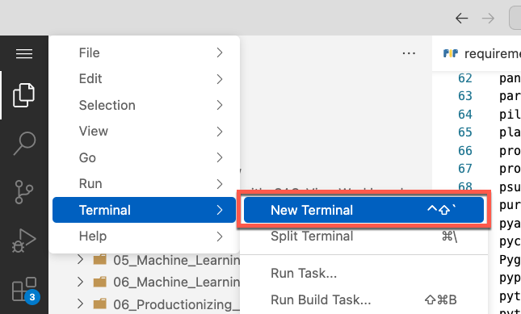

# Installing Required Python Libraries

To install the Python libraries required for this project, follow these instructions. It has to be done only one time.

*NB: These instructions assume you are using SAS Viya Workbench, but you can adjust them in any supported Python environment.*

- In Visual Studio Code, open a Terminal



- Run the following commands

```shell
cd <path-to-sas-education-cloned-folder>/sas1
pip install -r python/requirements.txt
```

- Restart your Python kernel if applicable
